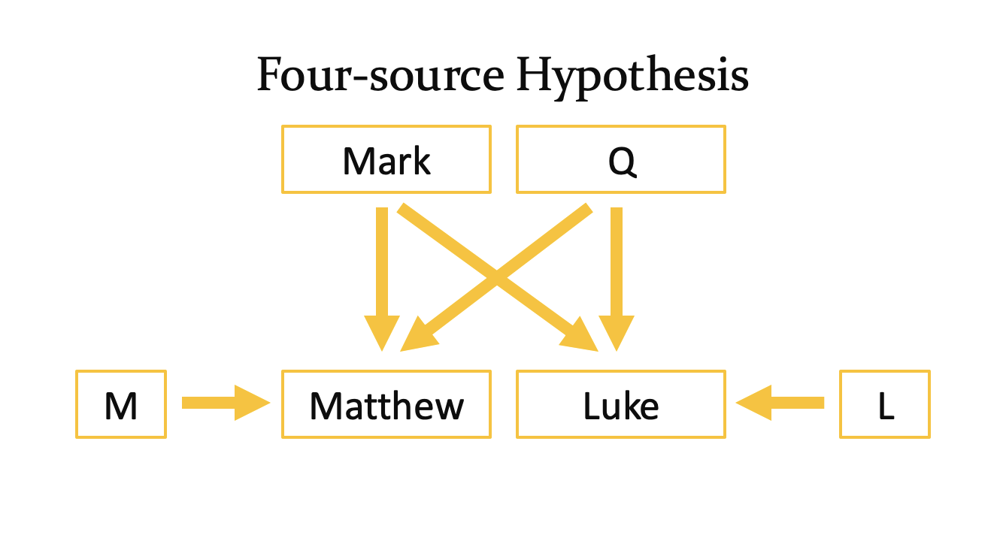
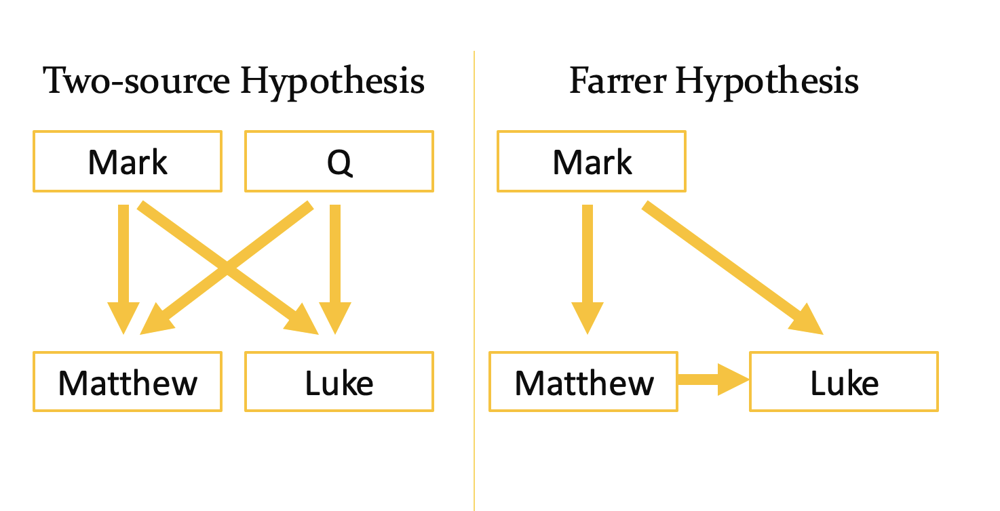

# The Synoptic Gospel Analysis
## Background
This project was made for a New Testament class I took. We were told we had to do a project that took 10 hours. I decided I wanted to look at the synoptic problem.

The synoptic problem is about the different theories that people have about what gospel writer in the New Testament wrote first. There is the four source hypothesis, where Mark was the original (with another source called Q) where Matthew and Luke pulled from those two sources and their own independend sources (M and L, respectively).

There is also the two source hypothesis which is very similar, but Matthew and Luke didn't pull from outside soureces and just used Mark and Q.

Finally, there is the Farrer hypothesis (not named after me, but Austin Farrer). It says that Mark was first and that Matthew and Luke pulled from Mark, but Luke also pulled from Matthew.

## Methods
I first parsed the three synoptic gospels. Then I ran it through a LLM (in this case, Perplexity) to get the 'meaning' of the different stories with the prompt "Summarize this text. Break it up into stories as feels natural." This gave me between 10 and 15 different paragraphs summarizing the stories. I did this to get a 'unified voice' that would take out the speech patterns of the authors and focus instead on the ideas. I then took this and sent it into a Count Vectorizer to get n-dimensional data. I performed Principal Component Analysis on this data to graph it in 3d space. The results are show in the figures directory.

## Analysis
You can see there is general overlap between the books. It seems that Mark is overlapped more than Matthew and Luke. I don't know if there is enough evidence to come to any conclusions here.
Note that Matthew is blue, Mark is green, and Luke is red.

## Problems
- the first three principal components didn't cover as much variance in the data as I would have liked
- the LLM didn't give me a lot of datapoints to work with. Ideally, I would have liked it to summarize groups of verses not groups of chapters